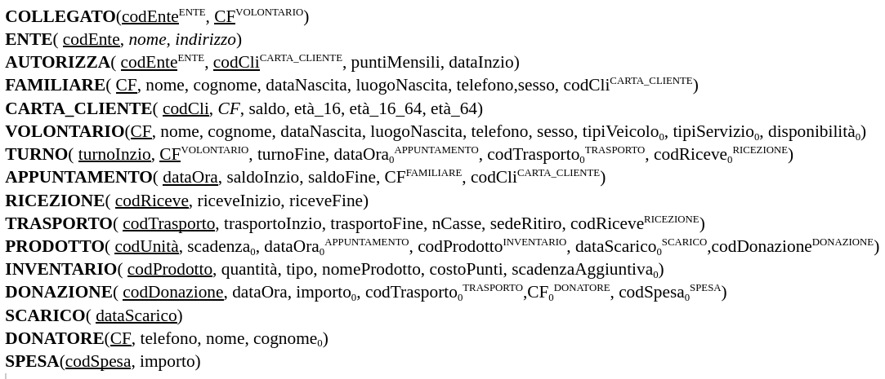

# PROGETTO: social market 

# PARTE I

> **Capiaghi Ludovico, Elia Federico, Savchuk Iryna**
>
> **Basi di Dati, team 4**
>
> **Informatica - Unige anno 21/22**

[TOC]

## Requisiti ristrutturati (1)

Abbiamo interpretato il dominio fornitoci nel seguente modo:

- Per i punti dei clienti, abbiamo usato numeri interi
- Memorizziamo gli enti che forniscono le autorizzazioni ( Servizi Sociali, Centri di Ascolto...) insieme agli enti che forniscono i volontari poiché riteniamo molti possano essere in comune, inoltre interpretiamo che un volontario possa essere associato a più enti
- Memorizziamo l'autorizzazione corrente e supponiamo che i punti mensili siano un'invariante legata all'autorizzazione, ogni mese il saldo della carta_cliente viene resettato ai punti mensili
- Memorizziamo i clienti come l'entità *CARTA_CLIENTE* a cui associamo poi tutti i familiari relativi, in *CARTA_CLIENTE* per riferirci al titolare di essa ( e relativi dati anagrafici) salviamo il *CF* del titolare. La carta cliente ha una durata per il periodo di 6 mesi da autorizza poi se si vuole rinnovare deve avere una nuova autorizzazione)
- Memorizziamo tutti i familiari per una carta_cliente ovvero tutti i familiari indipendemetemente dall'età del nulceo familiare
- La donazione può essere o in denaro o in merci
- Per i donatori, dividiamo in privati o aziende, e in aziende intendiamo anche gli esercizi commerciali che donano, un donatore può essere registrato anche se non ha ancora donato
- Utilizziamo l'entità SPESA per memorizzare le spese, ovvero l'utilizzo di denaro donato. 
- Abbiamo interpretato la ricezione di un gruppo di prodotti , attraverso la ricezione di uno o più traposrti (contiene una o più merci (gruppi di prodotti)) come il lavoro svolto da uno o più volontari per organizzare i prodotti nel magazzino, un trasporto deve essere ricevuto in una certa data-ora
- Per la data aggiuntiva di scadenza per i prodotti che deperibili che la memorizzano la intendiamo in numero di mesi aggiuntivi alla scadenza
- Lo scarico dei prodotti può avvenire una volta per giorno, quindi data identifica lo scarico
- Memorizziamo i turni dei dipendenti in slot di tempo collegati a uno specifico volontario il lavoro che svolge lo deduciamo poi dalle diverse associazioni con i diversi lavori (trasporta - riceve - supervisiona)
- Intendiamo il trasporto come un trasporto di una o più merci (donazioni diverse) mentre la ricezione è un lavoro che fanno più volontari su un trasporto

## Progetto concettuale (2)

### Diagramma ER (a)

### Documentazione relativa ai domini degli attributi  (b)

#### Descrizione entità

- **ENTE** è un ente che fornisce autorizzazione e/o fornisce volontari. Un autorizzazione ha una durata di 6 mesi ed è caratterizzata da un numero di punti mensili e una data di inizio
- **FAMILIARE** è una persona del nucleo familiare relativo ad una carta_cliente.
- **CARTA_CLIENTE** rappresenta il "cliente" inteso come la carta relativa ad un cliente e quindi in relazione nel_nucleo per una o più familiari intese come "gruppo familiare". CF in essa rappresenta il codice fiscale del titolare, di cui i dati anagrafici sono ricavabili dal familiare con quel CF. In fasce d'età si memorizzano il numero di familiari per ogni fascia d'età per ottimizzare non dovendo ricercare su tutti i familiari di un nucleo  le età.
- **VOLONTARIO** rappresenta il volontario del market 
- **TURNO** è uno slot di tempo di 2 ore identificato da data e ora e da un volontario, in cui il volontario può fare delle attività che consisotno nel partcipare alle relazioni supervisione - trasporta - riceve (riceve un trasporto ad un orario che può essere diverso da quello indicato in trasporto)
- **APPUNTAMENTO** rappresenta un appuntamento preso da un familiare e riferito ad una carta_cliente (la stessa in relazione con il familiare che ha preso l'appuntamento) in una certa data e ora, intendiamo rappresentare l'inizio dell'appuntamento. Gli appuntamenti devono essere scaglionati di 20 minuti (15 durata di appuntamento + 5 minuti tra due appuntamenti) quindi utilizziamo come chiave {data,ora} poiché risultano diverse per appuntamenti diversi
- **RICEZIONE** indica per una certa data e ora il lavoro di uno o più volontari per riceve uno o più trasporti
- **TRASPORTO** indica un trasporto in una certa ora e data per una o più merci e coinvolge uno o più volontari
- **PRODOTTO** è il singolo prodotto presente nel market inteso come singola unità
- **INVENTARIO** rappresenta una collezione dello stesso "tipo di prodotto", contiene infatti quantità e ha attributi comuni a tutti i prodotti di quel "tipo", la scandeza aggiuntiva è intesa come la durata in mesi aggiuntiva alla scadenza (di un'unità)
- **DONAZIONE** è una donazione avvenuta che avviene in una data e ora e può essere in *MERCE* o *DENARO*
- **DONATORE** è un donatore del market che ha effettuato almeno una donazione e può essere un **AZIENDA** (inteso anche come esercizio commerciale) o un **PRIVATO**
- **DENARO** rappresenta una donazione in denaro, caratterizzata da un importo
- **MERCE** è un insieme di prodotti che può essere donato da un donatore o acquista attraverso una spesa dal market, esso viene trasportato da uno o più volontari e ricevuto da uno o più volontari(organizzato nel market)
- **SCARICO** rappresenta uno scarico di prodotti avvenuto in una certa data
- **SPESA** è un importo di denaro (raccolto dalle donazioni in denaro) per acquistare merce (prodotti) o per spese di gestione (se non è in relazione con merce)

#### Identificatori aggiuntivi

Gli identificatori primari sono deducibili dallo schema indichiamo per le entità che ne hanno, quelli secondari.

**ENTE:**

- {nome,indirizzo}

**CARTA_CLIENTE:**

- CF

#### Domini attributi

**ENTE:**

| Attributo | Dominio |
| :-------- | ------- |
| codEnte   | int     |
| nome      | string  |
| indirizzo | string  |

**autorizza:**

| Attributo    | Dominio      |
| :----------- | ------------ |
| puntiMensili | int  [30,60] |
| dataInzio    | date         |

**CARTA_CLIENTE:**

| Attributo | Dominio                                          |
| :-------- | :----------------------------------------------- |
| codCli    | int                                              |
| CF        | string (16 caratteri)                            |
| saldo     | int (positivo)                                   |
| fasceEtà  | int (positivo) x int (positivo) x int (positivo) |

**FAMILIARE:**

| Attributo    | Dominio               |
| :----------- | :-------------------- |
| CF           | string (16 caratteri) |
| luogoNascita | string                |
| cognome      | string                |
| nome         | string                |
| dataNascita  | date                  |
| telefono     | string                |
| sesso        | {'M','F','Others'}    |

**VOLONTARIO**:

| Attributo     | Dominio                                                      |
| :------------ | :----------------------------------------------------------- |
| CF            | string (16 caratteri)                                        |
| luogoNascita  | string                                                       |
| cognome       | string                                                       |
| nome          | string                                                       |
| dataNascita   | date                                                         |
| telefono      | string                                                       |
| sesso         | {'M','F','Others'}                                           |
| tipiServizio  | string                                                       |
| disponibilità | {'Lunedì', 'Martedì', 'Mercoledì','Giovedì','Venerdì','Sabato','Domenica'} x time x time |
| tipoVeicolo   | string                                                       |

**TURNO:**

| Attributo  | Dominio   |
| :--------- | :-------- |
| turnoInzio | timestamp |
| turnoFine  | timestamp |

**APPUNTAMENTO**:

| Attributo  | Dominio        |
| :--------- | :------------- |
| dataOra    | timestamp      |
| saldoInzio | int (positivo) |
| saldoFine  | int (positivo) |

**RICEZIONE:**

| Attributo    | Dominio   |
| :----------- | :-------- |
| codRicezione | int       |
| riceveInzio  | timestamp |
| riceveFine   | timestamp |

**TRASPORTO:**

| Attributo      | Dominio        |
| :------------- | :------------- |
| codTrasporto   | int            |
| nCasse         | int (positivo) |
| trasportoInzio | timestamp      |
| trasportoFine  | timestamp      |
| sedeRitiro     | string         |

**PRODOTTO:**

| Attributo | Dominio |
| :-------- | :------ |
| codUnità  | int     |
| scadenza  | date    |

**INVENTARIO:**

| Attributo          | Dominio        |
| :----------------- | :------------- |
| codProdotto        | int            |
| quantità           | int (positivo) |
| tipo               | string         |
| nomeProdotto       | string         |
| costoPunti         | int (positivo) |
| scadenzaAggiuntiva | int (positivo) |

**DONAZIONE:**

| Attributo    | Dominio   |
| :----------- | :-------- |
| codDonazione | int       |
| dataOra      | timestamp |

**DONATORE:**

| Attributo | Dominio               |
| :-------- | :-------------------- |
| CF        | string (16 caratteri) |
| telefono  | string                |

**DENARO**:

| Attributo | Dominio         |
| :-------- | :-------------- |
| importo   | real (positivo) |

**SCARICO**:

| Attributo   | Dominio |
| :---------- | :------ |
| dataScarico | date    |

**AZIENDA**:

| Attributo   | Dominio |
| :---------- | :------ |
| nomeAzienda | string  |

**PRIVATO**:

| Attributo | Dominio |
| :-------- | :------ |
| cognome   | string  |
| nome      | string  |

**SPESA**:

| Attributo | Dominio         |
| :-------- | :-------------- |
| codSpesa  | int             |
| importo   | real (positivo) |

### Vincoli non esprimibili nel diagramma (c)

| Nome Vincolo | Entità - associazioni coinvolte                              | Vincolo                                                      |
| ------------ | ------------------------------------------------------------ | ------------------------------------------------------------ |
| V1           | autorizza - CARTA_CLIENTE                                    | due autorizzazioni per la stessa carta_cliente devono avere *dataInzio* distanti almeno di 6 mesi |
| V2           | prende  - FAMILIARE                                          | un familiare può prendere appuntamento solo se la sua età è maggiore di 16 anni |
| V3           | nel_nucleo - CARTA_CLIENTE                                   | per ogni *carta_cliente* deve esserci memorizzato in *familiare* un familiare  (titolare)  in relazione con la carta cliente tale per cui il  *CF* del familiare risulta uguale al *CF* della *carta_cliente* |
| V4           | APPUNTAMENTO                                                 | gli appuntamenti devono essere scaglionati di 20 minuti, di conseguenza non possono esserci due appuntamenti con la differenza minore di 20 minuti tra i rispettivi inizi (dataOra) |
| V5           | APPUNTAMENTO                                                 | *saldoFine* <= *saldoInzio*                                  |
| V6           | TURNO                                                        | *turnoInzio <= turnoFine*                                    |
| V7           | TURNO - riceve - RICEZIONE                                   | Un turno (volontario in uno slot temporale) in associazione riceve con ricezione deve avere *riceveInzio >= turnoInzio and riceveFine <= turnoFine* |
| V8           | TURNO - trasporta - TRASPORTO                                | Un turno in associazione trasporta con trasporto deve avere *trasportoInzio >= turnoInzio and riceveFine <= trasportoFine* |
| V9           | TURNO - supervisiona - APPUNTAMENTO                          | Un turno in associazione supervisiona con appuntamento deve avere *dataOra >= turnoInzio and dataOra <= trasportoFine* |
| V10          | TURNO - riceve - supervisiona - trasporta - TRASPORTO - APPUNTAMENTO - RICEZIONE | Per un turno non ci devono essere attività (svolte da volontario interessato) contemporanee ovvero sovrapposte temporalemente |
| V11          | RICEZIONE                                                    | *riceveInzio <= riceveFine*                                  |
| V12          | TRASPORTO                                                    | *trasportoInzio <= trasportoFine*                            |
| V13          | PRODOTTO                                                     | un prodotto se è in relazione con uno *scarico* (*scarta*) non può essere in relazione con un *appuntamento* (*acquista*) e viceversa |
| V14          | DENARO - SPESA                                               | la somma degli importi in *SPESA* è minore uguale alla somma degli importi di *DENARO* |
| V15          | MERCE                                                        | una  merce che è stata donata non può essere stata comprata e viceversa, quindi una merce può essere o in relazione con *donatore*(*dona*) o con *spesa*(*compra*) |
| V16          | MERCE - include - TRASPORTO                                  | una merce in relazione include con un trasporto deve soddisfare *dataOra <= trasportoInzio* |
| V17          | RICEZIONE - riceve_trasporto - TRASPORTO                     | un trasporto in relazione riceve_trasporto con una ricezione deve soddisfare trasportoInzio <= riceveInizio |
| V18          | autorizza                                                    | 30 <= puntiMensili <= 60                                     |

### Gerarchie (d)

| Gerarchia | Descrizione                                                  | Specifica             |
| --------- | ------------------------------------------------------------ | --------------------- |
| DONAZIONE | una donazione può essere specializzata in MERCE o DENARO a seconda che sia rispettivamente in prodotti o denaro | *totale ed esclusiva* |
| DONATORE  | un donatore può essere specializzato un PRIVATO o  un' AZIENDA | *totale ed esclusiva* |

## Progetto logico (3)

### Schema ER ristrutturato (a)

#### **Modifiche ristrutturazione (b)**

#### Scelte modifiche attributi

- **CARTA_CLIENTE** (attributo):
  - *fasceEtà*: abbiamo trasformato questo attributo multi-attributo in tre attributi corrispondenti a le tre classi di età, attributi:
    - età_<16: numero di familiari di età minore di 16 anni
    - età_16-64: numero di familiari di età compresa tra 16 e 64 anni
    - età_>64: numero di familiari di età maggiore di 64 anni

- **VOLONTARIO** (attributi): 
  - *disponibilità*: abbiamo trasformato questo attributo da multi-attributo multi valore ad un attributo singolo (opzionale) che utilizziamo come stringa che contiene le informazioni relative alla disponibilità di un volontario 
    - *Motivazioni:* non riteniamo per come interpretato il dominio che disponibilità  diventi a sua volta un'entità
  - *tipiServizio*: abbiamo trasformato questo attributo da un attributo multi-valore ad un attributo singolo (opzionale) che descrive a parole (stringa) i tipi di servizio di un volontario
    - *Motivazioni:* non riteniamo per come interpretato il dominio che tipiServizio  diventi a sua volta un'entità
  - *tipiVeicolo*: abbiamo trasformato questo attributo da un attributo multi-valore ad un attributo singolo (opzionale) che descrive a parole (stringa) i tipi di veicolo di cui il volontario dispone
    - *Motivazioni:* non riteniamo per come interpretato il dominio che tipiVeicolo  diventi a sua volta un'entità

#### Modifiche domini

Riportiamo solo le tabelle dei domini di relazioni di cui abbiamo modificato attributi durante relazione

**CARTA_CLIENTE:**

| Attributo  | Dominio               |
| :--------- | :-------------------- |
| codCli     | int                   |
| CF         | string (16 caratteri) |
| saldo      | int (positivo)        |
| età_<16    | int (positivo)        |
| età_ 16-64 | int (positivo)        |
| età_>64    | int (positivo)        |

**VOLONTARIO**:

| Attributo     | Dominio               |
| :------------ | :-------------------- |
| CF            | string (16 caratteri) |
| luogoNascita  | string                |
| cognome       | string                |
| nome          | string                |
| dataNascita   | date                  |
| telefono      | string                |
| sesso         | {'M','F','Others'}    |
| tipiServizio  | string                |
| disponibilità | string                |
| tipoVeicolo   | string                |

### Modifiche  dei vincoli (c)

Riportiamo tabella con sole aggiunte e modifiche di vicoli dovute a ristrutturazione 

| Nome Vincolo | Entità - associazioni coinvolte | Vincolo                                                      |
| ------------ | ------------------------------- | ------------------------------------------------------------ |
| V15          | DONAZIONE                       | una  donazione che è stata donata non può essere stata comprata e viceversa, quindi una donata può essere o in relazione con *donatore*(*dona*) o con *spesa*(*compra*) |
| V16          | DONAZIONE                       | una donazione in denaro (importo is not null) non può essere trasportata |
| V17          | DONAZIONE- include - TRASPORTO  | una donazione in relazione include con un trasporto deve soddisfare *dataOra <= trasportoInzio |
| V20          | DONAZIONE - compra - dona       | Se una donazione è in relazione con compra non può essere in relazione con dona e viceversa |

### Scelte fatte per l'eliminazione di gerarchie (d)

- **DONATORE** (gerarchia): eliminazione entità figlie (azienda e privato) mettendo in donatore attributi opzionali *cognome* che identifica un privato mentre nome indica il nome per un privato o il nomeAzienda per un'azienda (cognome non presente)
  - *Motivazioni*: riteniamo le entità azienda e privato non centrali nello schema e riteniamo che con attributi opzionali indicati si possa risalire comunque alla suddivisone tra i due tipo
- **DONAZIONE** (gerarchia): eliminazione entità figlie (denaro e merce) mettendo in donatore attributi opzionali *importo* che identifica una donazione in denaro, se non è presente  implicitamente è una donazione in merci.
  - *Motivazioni*: riteniamo denaro e merce riducibili entrambe a donazione, non aggiungendo nuovi attributi e riuscendo, per le motivazioni precedenti a identificarle
  - *Modifica cardinalità*: la cardinalità dell'associazione dona da parte di DONAZIONE è stata modificata da (1,1) a (0,1) perché ora una donazione (merce in particolare) può essere acquistata tramite spesa e quindi non essere in relazione con un donatore

### Schema logico (e)

### Verifica qualità dello schema (f)

