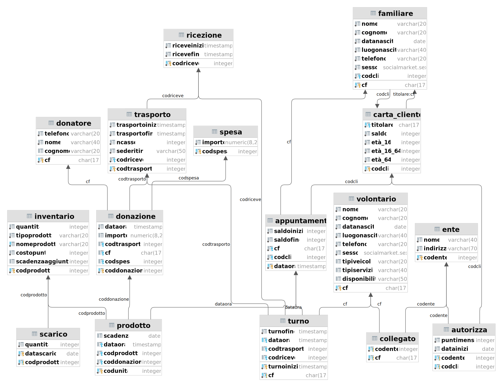

# PROGETTO: social market 

# PARTE II

> **Capiaghi Ludovico, Elia Federico, Savchuk Iryna**
>
> **Basi di Dati, team 4**
>
> **Informatica - Unige anno 21/22**

[TOC]

## Creazione dello schema (4)

### Specifica dei vincoli e implementazione

| Nome Vincolo | Relazioni coinvolte (schema logico)                          | Vincolo                                                      | Tipo vincolo | Implementato |
| ------------ | ------------------------------------------------------------ | ------------------------------------------------------------ | ------------ | ------------ |
| V1           | AUTORIZZA                                                    | due autorizzazioni per la stessa carta_cliente devono avere *dataInizio* distanti almeno di 6 mesi | trigger      |              |
| V2           | APPUNTAMENTO - FAMILIARE                                     | un familiare può prendere appuntamento solo se la sua età è maggiore di 16 anni | trigger      |              |
| V3           | FAMILIARE- titolare- nel_nucleo - CARTA_CLIENTE              | Il familiare in relazione titolare con un carta_cliente deve essere in relazione con la stessa carta_cliente attraverso la relazione nel_nucleo | trigger      |              |
| V4           | APPUNTAMENTO                                                 | gli appuntamenti devono essere scaglionati di 20 minuti, di conseguenza non possono esserci due appuntamenti con la differenza minore di 20 minuti tra i rispettivi inizi (dataOra) | trigger      |              |
| V5           | APPUNTAMENTO                                                 | *saldoFine* <= *saldoInizio*                                 | check        | SI           |
| V6           | TURNO                                                        | *turnoInizio <= turnoFine*                                   | check        | SI           |
| V7           | TURNO - RICEZIONE                                            | Un turno (volontario in uno slot temporale) in associazione riceve con ricezione deve avere *riceveInizio >= turnoInizio and riceveFine <= turnoFine* | trigger      | SI (E.A)     |
| V8           | TURNO - TRASPORTO                                            | Un turno in associazione trasporta con trasporto deve avere *trasportoInizio >= turnoInizio and riceveFine <= trasportoFine* | trigger      | SI (E.A)     |
| V9           | TURNO - APPUNTAMENTO                                         | Un turno in associazione supervisiona con appuntamento deve avere *dataOra >= turnoInizio and dataOra <= trasportoFine* | trigger      | SI (E.A)     |
| V10          | TURNO - TRASPORTO - APPUNTAMENTO - RICEZIONE                 | Per un turno non ci devono essere attività (svolte da volontario interessato) contemporanee ovvero sovrapposte temporalemente | trigger      | SI (E.A)     |
| V11          | RICEZIONE                                                    | *riceveInizio <= riceveFine*                                 | check        | SI           |
| V12          | TRASPORTO                                                    | *trasportoInizio <= trasportoFine*                           | check        | SI           |
| V13          | PRODOTTO                                                     | un prodotto se è in relazione con uno *scarico* (*scarta*) non può essere in relazione con un *appuntamento* (*acquista*) e viceversa. | check        | SI           |
| V14          | DENARO - SPESA                                               | la somma degli importi in *SPESA* è minore uguale alla somma degli importi di *DENARO* | trigger      |              |
| V15          | DONAZIONE                                                    | una  donazione che è stata donata non può essere stata comprata e viceversa, quindi una donata può essere o in relazione con *donatore*(*dona*) o con *spesa*(*compra*) | check        | SI           |
| V16          | DONAZIONE- TRASPORTO                                         | una donazione in relazione include con un trasporto deve soddisfare *dataOra <= trasportoInizio* | trigger      |              |
| V17          | RICEZIONE - TRASPORTO                                        | un trasporto in relazione riceve_trasporto con una ricezione deve soddisfare trasportoInizio <= riceveInizio | trigger      |              |
| v18          | PRODOTTO - INVENTARIO - SCARICO - scarta - di_tipo  - acquista - APPUNTAMENTO | La quantità di un prodotto p in inventario deve essere il numero di unità (in prodotto) in relazione di_tipo con p e non acquistai e non scartati | trigger      | SI (E.B)     |
| V19          | DONAZIONE                                                    | Se una donazione è in relazione con compra non può essere in relazione con dona e viceversa | check        | SI           |
| V20          | DONAZIONE                                                    | una donazione in denaro (importo is not null) non può essere trasportata | check        | SI           |
| V21          | TURNO                                                        | Non ci possono essere turni con lo stesso dataOra (dataOra  è unique) | unique       | SI           |

## Diagramma (5)

