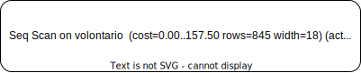
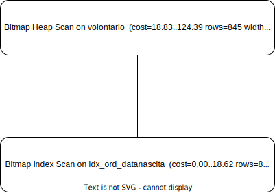
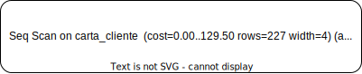
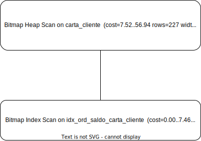

# PROGETTO: social market 

# PARTE III

> **Capiaghi Ludovico, Elia Federico, Savchuk Iryna**
>
> **Basi di Dati, team 4**
>
> **Informatica - Unige anno 21/22**

[TOC]

## **Progetto fisico e sua valutazione (9)**

### Interrogazioni e carico di lavoro (a)

#### Query_1

Matilde, membro del social market, frequentemente organizza feste per  i volontari per fasce d'età (in questo caso che hanno meno di 25 anni)

```sql
SELECT CF
FROM Volontario
WHERE dataNascita > '1997-1-1';
```

#### Query_2

Marco, organizzatore del social market, spesso necessita di sapere quali clienti hanno saldo "critico" (minore di 10 punti) e hanno nuclei familiari con almeno due elementi in una delle fasce "sensibili" (minori di 16 anni o maggiori di 64 anni).

```sql
SELECT codCli
FROM CARTA_CLIENTE
WHERE saldo < 5  and (età_16 >= 2 or età_64 >= 2);
```

#### Query_3

Gino, organizzatore se social market si occupa della gestione dei prodotti ed è spesso interessato a capire quali prodotti del market sono arrivati a partire da una certa in donazioni con trasporti piccoli, ovvero trasporti con numero di casse minore di 3

```sql
SELECT codUnità
FROM Prodotto JOIN Donazione ON Prodotto.codDonazione = Donazione.codDonazione
JOIN Trasporto ON Donazione.codTrasporto = Trasporto.codTrasporto
WHERE nCasse < 3 and Donazione.dataOra < '2022-06-01';
```

### Progetto fisico (b)

#### Query_1

Per la prima query del carico di lavoro scelto,  scegliamo di creare a suo supporto un indice ordinato clusterizzato (secondario) ad albero sull'attributo dataNascita della tabella VOLONTARIO, questo ci permetterà di effettuare una selezione di tipo range sull'attributo in modo più efficiente, lo creiamo clusterizzato perché per il nostro carico di lavoro è necessario creare su volontario un solo indice.

```sql
CREATE INDEX idx_ord_dataNascita_volontario 
ON Volontario (dataNascita);

CLUSTER Volontario
USING idx_ord_dataNascita_volontario;
```

#### Query_2

Per la seconda query del carico di lavoro scelto, abbiamo scelto di creare a suo supporto un indice ordinato clusterizzato (secondario) ad albero sull'attributo saldo, poiché l'attributo saldo nella query_2 è il fattore booleano e quindi ci permette di selezionare più efficientemente rappresentando una condizione che se false rende falsa la selezione della tupla considerata, nel nostro caso possiamo percorrere l'indice e trovare il punto nel file da cui poi scorrere i blocchi nel senso inverso all'ordinamento, essendo clusterizzato  rendiamo così minimi gli accessi ai blocchi.

```sql
CREATE INDEX idx_ord_saldo_carta_cliente
ON Carta_Cliente (saldo);

CLUSTER Carta_Cliente
USING idx_ord_saldo_carta_cliente;
```

#### Query_3

Per la terza query del carico di lavoro scelto, abbiamo scelto di creare due indici clusterizzati uno per nCasse su trasporto e uno su dataOra per donazione poiché risultano utilizzi per un accesso più efficiente alle relazioni di base coinvolte nella query, in particolare abbiamo notato che non era conveniente provare ottimizzare il join, poiché il sistema esegue il join attraverso l' hash join che risulta comunque efficiente al pari o meglio del merge join.

```sql
CREATE INDEX idx_ord_ncasse_trasporto
ON Trasporto (nCasse);

CLUSTER Trasporto
USING idx_ord_ncasse_trasporto;

CREATE INDEX idx_ord_dataOra_Donazione
ON Donazione (dataOra);

CLUSTER Donazione
USING idx_ord_dataOra_Donazione;
```

### Dimensioni tabelle coinvolte (c)

```sql
SELECT relname, relpages as numeropagine, reltuples as numeroTuple 
FROM pg_namespace N JOIN pg_class C ON N.oid = C.relnamespace
WHERE N.nspname = 'socialmarket' AND relname IN ('volontario', 'carta_cliente', 'trasporto', 'donazione', 'prodotto');
```
| relname       | numeropagine | numerotuple |
| ------------- | ------------ | ----------- |
| carta_cliente | 42           | 5000        |
| volontario    | 94           | 5000        |
| trasporto     | 66           | 6000        |
| donazione     | 64           | 8166        |
| prodotto      | 59           | 10634       |


### Descrizione piani di esecuzione (d)

#### Query_1

| Prima                                                        | Dopo                                                         |
| ------------------------------------------------------------ | ------------------------------------------------------------ |
|                                              |                                              |
| Viene utilizzato una scansione sequenziale di volontario con filtro dataNascita >'1997-01-01' | Viene utilizza una scansione con indice in particolare la combinazione di bitmap + heap scan utilizzando l'indice da noi creato su volontario con filtro dataNascita >'1997-01-01' |
| Execution Time: 0.681 ms                                     | Execution Time: 0.144 ms                                     |

**Commento:**

Come già accennato durante la scelta del piano fisico, la query che precedentemente viene eseguita con una banale scansione sequenziale può ora essere eseguita ottimizzando nettamente il tempo di esecuzione utilizzando un accesso con l'indice clusterizzato (porta all'accesso dei minori blocchi possibili) sulla dataNascita in volontario.

#### Query_2

| Prima                                                        | Dopo                                                         |
| ------------------------------------------------------------ | ------------------------------------------------------------ |
|                                              |                                              |
| Viene utilizzata una scansione sequenziale con filtro la formula booleana coomplessa della query | Viene utilizzata una scansione con indice sull'indice clusterizzato da noi creato su saldo (fattore booloeano della query) di carta_cliente, viene utlizzata una bitmap index scan sulla condizione di saldo in combinazione con una successiva heap index scan che aggiunge il filtro della restante parte della condizione booleana (che è in and) |
| Execution Time: 0.429 ms                                     | Execution Time: 0.076 ms                                     |

**Commento:**

Avendo creato un indice su il fattore booleano della query (saldo) il sistema utilizza una scansione con indice su di esso applicando poi successivamente il filtro per implementare la seconda parte della condizione booleana  in and, impiegando un tempo decisamente inferiore alla scansione sequenziale con filtro iniziale

#### Query_3

| Prima | Dopo  |
| ----- | ----- |
|  |  |
|       |       |
|       |       |

**Commento:**


## **Descrizione transazione (10)**

Un' ente vuole rinnovare l'autorizzazione per un determinato titolare *cliente* , e conosce il suo indirizzo, *indirizzoEnte*,  e il suo nome *indirizzoNome* ( che sono chiave univoca in ente), la transazione che implementa questa operazione deve effettuare:

- una lettura da ENTE per determinare codEnte dell'ente
- una lettura da CARTA_CLIENTE per determinare il codCli della tessera del cliente
- una scrittura (update) su AUTORIZZA per impostare la data dell'autorizzazione  alla data odierna per la tupla con  codEnte e codCli come chiave 

Il corrispondente codice SQL per la transazione è:

```sql
-- i valori nelle variabili sono per test
BEGIN TRANSACTION;
DO $$
DECLARE  enteCod int;
DECLARE  cliCod  int;
DECLARE  nomeEnte varchar := 'Nibali, Ginese e Trupiano SPA'; 
DECLARE  indirizzoEnte varchar := 'Incrocio Fabrizia, 99 Piano 8 42024, Castelnovo Di Sotto (RE)';
DECLARE cliente char(17) := 'PJBBKX81R05M263F ';
BEGIN
        SELECT E.codEnte INTO enteCod
        FROM Ente E
        WHERE E.nome = nomeEnte and E.indirizzo = indirizzoEnte;
        
        SELECT C.codCli INTO cliCod
        FROM Carta_Cliente C
        WHERE C.titolare = cliente;
        
        UPDATE Autorizza
        SET dataInizio = current_date
        WHERE codEnte = enteCod and codCli = cliCod;
END$$;
COMMIT;
```

Per questa transazione il livello di isolamento consigliato è il **READ COMMITED** poiché non riteniamo di dover considerare anomalie di *phantom row* dato che le letture effettuate nella transazione coinvolgono singole tuple, riteniamo che acquisire i lock sulle intere tabelle sia eccessivo, inoltre anche le anomalie di *unreptable read* non ci interessano poiché non effettuiamo letture ripetute sulla stessa risorsa nel corso della transazione  

Il livello *REPETABLE READ* fa si che nella nostra transazione debbano essere acuisti i lock di scrittura (esclusivi) all'inizio e rilasciati al suo termine (COMMIT o ROLLBACK) mentre i lock condivisi (lettura) vengono acquisiti e rilasciati appena possibile, questo ci permette di evitare*:

- *lost update*: in caso una transazione concorrente leggesse  la tupla  X di AUTORIZZA prima che la nostra transazione la modifichi e poi dopo la nostra modifica (non avendola vista) la modificasse ulteriormente si perderebbe il nostro update, questo è evitato acquisendo il lock di scrittura (esclusivo) su X, una transazione concorrente non potrà acquisire un lock in lettura su X fino al COMMIT della transazione e quindi leggere in seguito un valore aggiornato.
- *dirty read:* in caso una transazione T2 concorrente volesse leggere la tupla che aggiorniamo X di AUTORIZZA, nel caso in cui la nostra transazione andasse in rollback e la lettura effettuata da T2 avvenisse prima del ROLLBACK, essa leggere un valore "sporco" e quindi acquisendo il lock su X in scrittura e rilasciandolo solo al ROLLBACK della transazione T2 potrebbe acquisire lock solo quando il valore di X è stato riprisitinato ad uno stato corretto.


## **Controllo dell'accesso (11)**

#### Alice

Alice è *gestore del social market* quindi ragionevolmente potrà avere tutti i permessi sullo schema social market 

```sql
-- ALICE gestore del social market
CREATE USER Alice password 'Alice';
GRANT USAGE ON SCHEMA socialmarket TO Alice WITH GRANT OPTION;
-- garantiamo ad Alice tutti i permessi
GRANT ALL PRIVILEGES ON SCHEMA socialmarket to Alice WITH GRANT OPTION;
```


#### Roberto

Roberto è un *volontario del social market*,  e ha il permesso di visualizzare tutti i suoi turni e le attività da lui svolte, ma non può inserirle lui, pensiamo sia infatti compito dell'organizzazione preparare i turni. 

Roberto è un volontario che spesso di occupa dello scarico ha quindi l'autorità di eseguire uno scarico e quindi di registrare le quantità di prodotti scaricati, ma anche di rimuovere i prodotti scaricati dalla base di dati.

```sql
-- ROBERTO: volontario del social market
INSERT INTO volontario  VALUES ('PGNRRT75D01H703D', 'Roberto', 'Paganini', '1975-04-01', 'Salerno', '333333333333', 'M', 'Wagon' , 'ricezione , supervisione , trasporto', 'Mercoledì mattina ');
CREATE USER Roberto PASSWORD 'roberto';

GRANT USAGE ON SCHEMA socialMarket TO roberto;

-- permesso di leggere tutti i suoi turni, appuntamenti, trasporto, ricezione
CREATE VIEW turniCF AS
SELECT *
FROM turno
WHERE CF = 'PGNRRT75D01H703D';

CREATE VIEW appuntamentoCF AS
SELECT *
FROM appuntamento
WHERE dataora = (SELECT dataOra FROM turniCF);

CREATE VIEW trasportoCF AS
SELECT *
FROM trasporto
WHERE codTrasporto = (SELECT codTrasporto FROM turniCF);

CREATE VIEW ricezioneCF AS
SELECT *
FROM ricezione
WHERE codRiceve = (SELECT codRiceve FROM turniCF);

GRANT SELECT ON turniCF,appuntamentoByTurniCF,trasportoByTurniCF,ricezioneByTurniCF TO roberto;

-- permesso di leggere e modificare su prodotto
GRANT SELECT,DELETE ON prodotto TO roberto;

-- permesso di inserire in scarico
GRANT INSERT ON scarico TO roberto;
```
